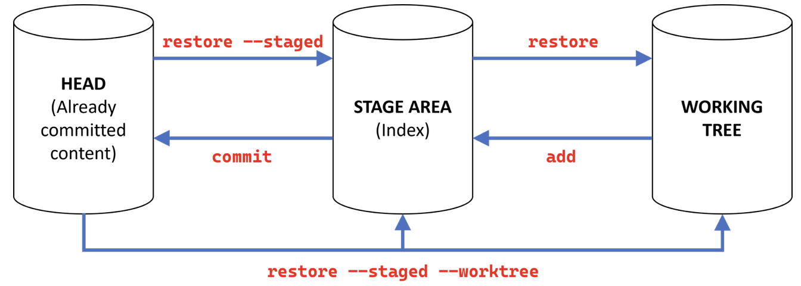

<h1 align="center"> Git </h1>

# Table of content

<!-- vim-markdown-toc GFM -->

* [Introduction](#introduction)
* [Tips](#tips)
  * [Browse the history](#browse-the-history)
  * [Terminology](#terminology)
    * [General](#general)
    * [About commits](#about-commits)
* [git commands](#git-commands)
  * [git clone](#git-clone)
  * [git commit](#git-commit)
  * [git diff](#git-diff)
  * [git init](#git-init)
  * [git log](#git-log)
  * [git mv](#git-mv)
  * [git reset](#git-reset)
  * [git revert](#git-revert)
  * [git restore](#git-restore)
  * [git rm](#git-rm)
  * [git status](#git-status)
  * [git worktree](#git-worktree)
* [Resources](#resources)

<!-- vim-markdown-toc -->

# Introduction

# Tips

## Browse the history

**Great alias !**

`$ git config --global alias.lg "log --graph --date=relative --pretty=tformat:'%Cred%h%Creset -%C(auto)%d%Creset %s %Cgreen(%an %ad)%Creset'"`

`$ git lg -10`: Display the last 10 commits  
`$ git lg <my_file>`: Display changes related to specific file(s) or directories  
`$ git lg <my_branch>`: Same for 1 or multiple branches  
`$ git lg master..dev`: Specific intervals (works as well with tags)  
`$ git lg --since='1 week ago' --all`: Various alternatives are possible

`--branches`: For local branches  
`--all`: For remotes stuffs (branches, tags, stash)  
`--merges`: Check merges

## Terminology

- `index` = `staging area`: Next files to be commited

### General

### About commits

- `HEAD`: The current branch, represented in `.git/HEAD` and as well a pointer to the last commit
- `HEAD^`: Second last commit, equivalent to `HEAD~1`
- `HEAD^^`: Third commit from the top
- `HEAD~3` = `Head^^^` (No number means 1)
- `HEAD~5..HEAD~2`

# git commands

## git clone

Clone a repository into a new directory

`--bare`: Create a bare repository  
_Useful in case of working with git worktree_

## git commit

Record changes to the repository

`-m <msg>`: Use the given \<msg> as the commit message

`--amend <msg>`: Replace the tip of the current branch by creating a new commit  
This command takes your staging area and uses it for the commit.
If you’ve made no changes since your last commit (for instance, you run this command
immediately after your previous commit), then your snapshot will look exactly the same,
and all you’ll change is your commit message.

## git diff

Show changes between commits, commit and working tree, etc

## git init

Create an empty Git repository or reinitialize an existing one

`--bare`: Create a bare repository  
_Useful in case of working with git worktree_

## git log

Show commit logs

_See [Browse the history](#browse-the-history)_

## git mv

Move or rename a file, a directory, or a symlink

## git reset

Reset current HEAD to the specified state  
git-reset is about updating your branch, moving the tip in order to add or remove commits from the branch.
This operation changes the commit history.

`$ git reset HEAD <file(s)>`: Unstage \<file(s)>  
is requivalrent to `$ git restore --staged <file(s)>`

_git-reset can also be used to restore the index, overlapping with git-restore._

## git revert

Revert some existing commits  
git-revert is about making a new commit that reverts the changes made by other commits.

`-n` : Do not create a new commit

`$ git revert <commit>`: Revert the changes specified by the commit and create a new commit with the reverted changes.

## git restore

Restore working tree files

git-restore is about restoring files in the working tree from either the index or another commit.
This command does not update your branch.
The command can also be used to restore files in the index from another commit.

`$ git restore --staged <file(s)>`: Restore a file in the index to match the version in HEAD  
`$ git restore --source=HEAD --staged --worktree <file(s)>`: Restore both the index and the working tree  
Which is equivalent to `git checkout`

## git rm

Remove files from the working tree and from the index

`--cached`: Keep the file in the directory but Git will not track it anymore

## git status

Show the working tree status

`-s`: Give the output in the short-format

## git worktree

Manage multiple working trees

_Command to be used when working with a bare repo_

`$ git worktree add`  
`$ git worktree remove`  
`$ git worktree list`

# Resources

- <https://delicious-insights.com/fr/articles-et-tutos/git-log/>
- <https://stackoverflow.com/questions/2221658/whats-the-difference-between-head-and-head-in-git>
- <https://git-scm.com>
- <https://git-scm.com/book/en/v2>
