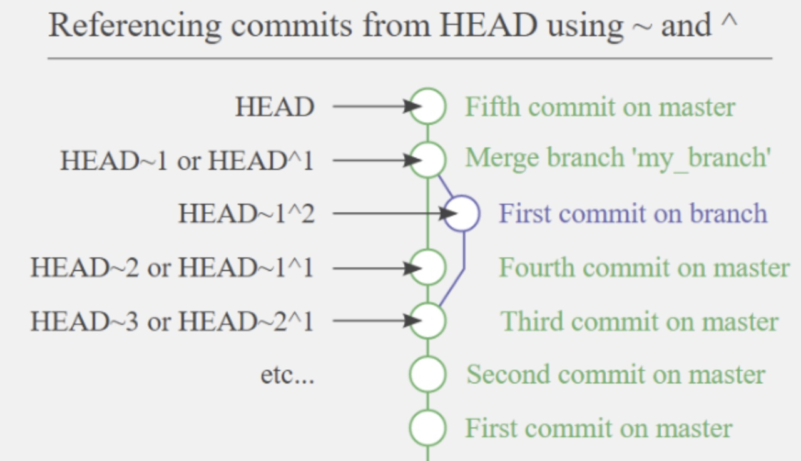
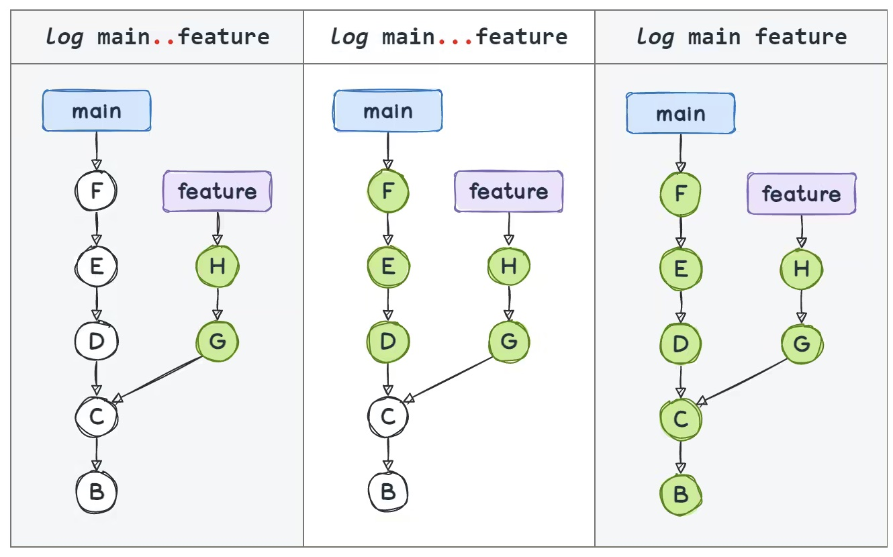
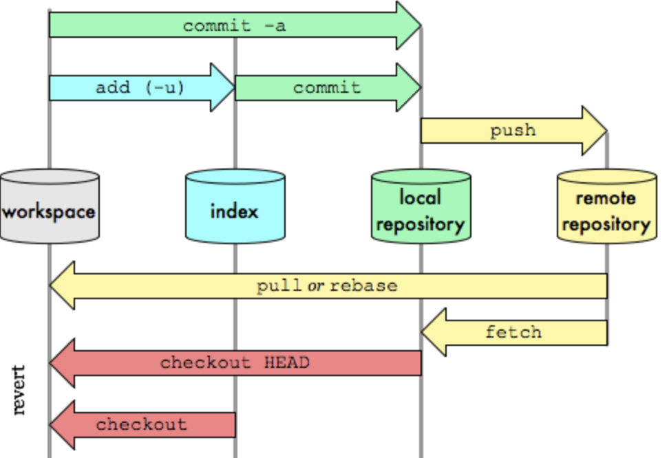

<div align=center>
<h1> My Git CheatSheet </h1>
</diV>

# Table of content

<!-- vim-markdown-toc GFM -->

* [Introduction](#introduction)
  * [Backlog / Todo](#backlog--todo)
  * [General](#general)
  * [Aliases](#aliases)
  * [Terminology](#terminology)
    * [General](#general-1)
    * [About commits and ranges of commits](#about-commits-and-ranges-of-commits)
* [Basics](#basics)
  * [git init, clone](#git-init-clone)
  * [git add, rm, diff, status](#git-add-rm-diff-status)
  * [git commit](#git-commit)
  * [git reset](#git-reset)
  * [git restore](#git-restore)
  * [git blame & bisect](#git-blame--bisect)
* [Sharing & Updating](#sharing--updating)
  * [git fetch](#git-fetch)
  * [git pull](#git-pull)
  * [git push](#git-push)
  * [git remote & ls-remote](#git-remote--ls-remote)
* [Branching, Merging & Patching](#branching-merging--patching)
  * [git branch](#git-branch)
  * [git checkout](#git-checkout)
  * [git switch](#git-switch)
  * [git merge](#git-merge)
  * [git mergetool](#git-mergetool)
  * [git log](#git-log)
  * [git stash](#git-stash)
  * [git tag](#git-tag)
  * [git revert](#git-revert)
  * [git rerere](#git-rerere)
  * [git rebase](#git-rebase)
  * [git worktree](#git-worktree)
* [Resources](#resources)

<!-- vim-markdown-toc -->

# Introduction

## Backlog / Todo

- Explore custom configuration of git mergetool (i.e. Use nvim diff)

## General

Great visual representation of the git stages & commands

- <http://ndpsoftware.com/git-cheatsheet.html>

Guidelines

- **Do not rebase commits that exist outside of local repository**, people may
  have based work on.
- Use **--dry-run** option available with most commands to check results before
  hand

## Aliases

```bash
$ git config --global alias.co checkout
$ git config --global alias.br branch
$ git config --global alias.ci commit
$ git config --global alias.st status
$ git config --global alias.lg "log --graph --date=relative --pretty=tformat:'%Cred%h%Creset -%C(auto)%d%Creset %s %Cgreen(%an %ad)%Creset'"
$ git config --global alias.unstage 'reset HEAD --'
$ git config --global alias.last 'log -1 HEAD'
$ git config --global push.default current
$ git config --global rerere.enabled true
```

- `$ git unstage <file>` = `$ git reset HEAD -- <file>`
- `$ git last`: Display last commit

- `$ git lg`: Friendly log display  
  `$ git lg -10`: Display the last 10 commits  
  `$ git lg <my_file>`: Display changes related to specific file(s) or directories  
  `$ git lg <my_branch>`: Same for 1 or multiple branches  
  `$ git lg master..dev`: Specific intervals (works as well with tags)  
  `$ git lg --since='1 week ago' --all`: Various alternatives are possible

`--branches`: For local branches  
`--all`: For remotes stuffs (branches, tags, stash)  
`--merges`: Check merges

**push.default** set to **current**: Used to simplify the push command. Push the
current branch to update a branch with the same name on the receiving end. Works
in both central and non-central workflows.

## Terminology

- **Index** = **Staging area**: Next files to be commited.
- **Detached Head state**: When HEAD refers to a specific commit or remote
  repository, as opposed to referring to a named branch (e.g. After running `git
checkout <sha1>`). If commits are added on top of a detached HEAD, nothing
  refers to those commits. Eventually those commits will be deleted by the GC.
  `git checkout -b foo` or `git switch -c foo` or `git branch foo` or `git tag
foo`, any of those will create a reference to it.
- **Fast-forward**: if the targeted branch commit is directly ahead of the
  commit of the current branch, Git simply moves the pointer forward. When you try
  to merge one commit with a commit that can be reached by following the first
  commit’s history, Git simplifies things by moving the pointer forward because
  there is no divergent work to merge together — this is called a “fast-forward.
- **rerere**: Reuse recorded resolution of conflicted merges.
- **git gc**: Garbage collection.The command does a number of things: it gathers
  up all the loose objects and places them in packfiles, it consolidates packfiles
  into one big packfile, and it removes objects that are not reachable from any
  commit and are a few months old.
- **Plumbing and Porcelain**: subcommands that do low-level work and were
  designed to be chained together UNIX-style or called from scripts. These
  commands are generally referred to as Git’s “plumbing” commands, while the more
  user-friendly commands are called “porcelain” commands.
- **Reflog**: A log of where HEAD and branch references have been for the last
  few months `git reflog`. This can be very useful to restore files, for
  instance after a `git reset --hard` mistake.

### General

### About commits and ranges of commits

**HEAD references**

- `HEAD`: The current branch, represented in `.git/HEAD` and as well a pointer
  to the last commit
- `HEAD^`: The parent of HEAD
- `HEAD~1`: The parent of HEAD
- `HEAD^2`: The second parent of HEAD (in case of multiple parents, e.g. merge)
- `HEAD~2`: The first parent of the first parent or “the grandparent”
- `HEAD~3` = `Head^^^`



**Commit ranges**

- `$ git log HEAD~5..HEAD~2`: list of 3 commits, starting at HEAD~2
- `$ git log master..experiment`: All the commits from experiment not yet merged
  into master. i.e. All commit reachable from experiment and not reachable by
  master
- `$ git log experiment..master` All commits in master that are not in
  experiment
- `$ git log origin/master..HEAD`: Any commits in current branch that aren’t in
  the remote origin, master branch. If git push is executed , the commits listed
  by `git log origin/master..HEAD` are the commits that will be transferred to the
  server
- `$ git log branch1...branch2`: All the commits that are reachable by either of
  two references but not by both of them



**Additional syntax**

Equivalent commands

- `$ git log refA..refB`
- `$ git log ^refA refB`
- `$ git log refB --not refA`

**More that two references query**

All commits that are reachable from refA or refB but not from refC

- `$ git log refA refB ^refC`
- `$ git log refA refB --not refC`

# Basics

## git init, clone

`--bare`: Create a bare repository i.e. _Useful in case of working with git worktree_

## git add, rm, diff, status

- `$ git rm --cached`: Keep the file in the directory but Git will not track it anymore
- `$ git status -s`: Give the output in the short-format

## git commit

Record changes to the repository

- `$ git commit -m <msg>`: Use the given \<msg> as the commit message
- `$ git commit --amend`:
  - if no files were changed, just open the editor to edit the commit message
  - if changes are staged, include those changes in the new commit

## git reset

Reset current HEAD to the specified state git-reset is about updating your
branch, moving the tip in order to add or remove commits from the branch. This
operation changes the commit history.

- `$ git reset HEAD <file(s)>`: Unstage \<file(s)> that are currently in stage area.
  - This is equivalrent to `$ git restore --staged <file(s)>`
- `$ git reset --soft HEAD~2`: Move what HEAD points to
  - Undo the last 2 commits in this example and commited files are in stage
    area
  - With last commit HEAD~, it's the same as `git commit --amend`
- `$ git reset --mixed HEAD~`: Undo last commit and unstage everything
  - **Default option** when calling `git reset` with no option
- `$ git reset --hard HEAD~`: Undo last commitm, unstage everything & clean
  working directory
  - One of the very few cases where Git will actually destroy data

The reset command overwrites the three trees (HEAD, STAGE / INDEX, WORKING TREE)
in a specific order, stopping when you tell it to:

- Move the branch HEAD points to (stop here if --soft).
- Make the index look like HEAD (stop here unless --hard).
- Make the working directory look like the index.

## git restore

Restore working tree files


git-restore is about restoring files in the working tree from either the index
or another commit. This command does not update your branch. The command can
also be used to restore files in the index from another commit.

- `$ git restore --staged <file(s)>`: Restore a file in the index to match the
  version in HEAD
- `$ git restore --source=HEAD --staged --worktree <file(s)>`: Restore both the
  index and the working tree. This is equivalent to `git checkout`.

## git blame & bisect

`$ git blame -L <start>,<stop> <file>`: List commiter(s) for the lines between
start & stop

# Sharing & Updating

## git fetch

Download objects and refs from another repository

- `$ git fetch <remote>` : Fetch origin by default if remote is not specified
- `$ git fetch --all` : Fetch all remotes



## git pull

Fetch from and integrate with another repository or a local branch

- `$ git pull`
- `$ git pull origin`

**Avoid `git pull`, preferred method is `git fetch` & `git merge`**

## git push

Update remote refs along with associated objects

- `$ git push <remote> <name>`: Push remote branch
- `$ git push origin <tagname>`: Push a particular tag
- `$ git push origin --tags`: Push all tags
- `$ git push origin --delete <name>`: Push removal of branch name
- `$ git push origin --delete <tagname>`: Delete a remote tag

## git remote & ls-remote

Manage set of tracked repositories

- `$ git remote add <shortname> <url>`: Add a remote, shortname can be used for
  git commands
- `$ git remote rename <current> <new>` : Rename a remote reposity
- `$ git remote remove <shortname>` : Remove a remote reposity
- `$ git remote show <remote>`: Gives some information about remote
- `$ git ls-remote`
- `$ git ls-remote <remote>`

`-v`: Display URL

# Branching, Merging & Patching

## git branch

List, create, or delete branches

- `$ git branch`: List existing branches
- `$ git branch <name>`: Create a new branch (i.e. creates a new pointer against
  current commit)
- `$ git branch -d <name>`: Delete branch
- `$ git branch -v`: List the last commit for each branch
- `$ git branch -vv`: List the remote tracked branches (i.e. generally executed
  after `$ git fetch --all`)
- `$ git branch --merged`: Find all branches which can be safely deleted, since
  those branches are fully contained by HEAD.
- `$ git branch --no-merged`: Find branches which are candidates for merging
  into HEAD, since those branches are not fully contained by HEAD.
- `$ git branch --move <old_name> <new_name>`: Rename the branch locally
- `$ git push --set-upstream origin <new_name>`: Push the new branch name
- `$ git push origin --delete <name>`: Push removal of branch name
- `$ git branch -u <remote>/<name>`: Change the upstream branch being tracked
  against the current local branch

## git checkout

Switch branches or restore working tree files

_From Git version 2.23 onwards you can use git switch instead of git checkout_

- `$ git checkout -b <branch>`: Create & Switch to a new branch (Locally)
- `$ git checkout -b <branch> <remote>/<branch>`  
   = `$ git checkout --track <remote>/<branch>`  
   = `$ git checkout <branch>`  
  Switch to a branch _This moves the `HEAD` to point to the branch_
- `$ git checkout -b <local_n> <remote>/<branch>`: Use a specific local name

**Special**

- `$ git restore --source=HEAD --staged --worktree <file(s)>`: Restore both the
  index and the working tree, which is equivalent to `git checkout`

## git switch

Switch branches

- `$ git switch <branch>`: Switch to a branch
- `$ git switch -c <branch>`: Create a branch and switch to it
- `$ git switch - `: Switch back to the previous branch

## git merge

Join two or more development histories together

- `$ git merge <branch_name>`: Merge _branch_name_ with current branch

**fast-forward**: _see [Terminology](#terminology)_

## git mergetool

Run merge conflict resolution tools to resolve merge conflicts

`$ git mergetool`: Run one of several merge utilities to resolve merge
conflicts (i.e. typically after git merge)

**git mergetool** creates \*.orig backup files while resolving merges. These are
safe to remove once a file has been merged and its git mergetool session has
completed.

## git log

Show commit logs

_See [Browse the history](#browse-the-history)_

## git stash

Stash the changes in a dirty working directory away

- `$ git stash`: Record the current state of the working directory and the index
- `$ git stash push -m <msg>`: Same as with no option but adding a description
- `$ git stash list`: List of stored stashes
- `$ git stash show`: Diplay modification of the most recent stash
- `$ git stash apply`: Apply the most recent stash (Keep the stash in stash list)
- `$ git stash apply stash@{ID}`: Apply a specific stash based on ID
- `$ git stash apply --index`: Re-apply the staged changes
- `$ git stash drop stash@{ID}`: Drop the stash ID
- `$ git stash pop`: Apply the stash and immediately drop it from the stack
- `$ git stash branch testchanges`: Recover stashed work easily and work on it in a new branch.

stash@{0} representd the most recently created stash, stash@{1} is the one before it,
etc.

Additional useful options:

- `--keep-index`: Only include staged content in new stash, simultaneously leave it in the index
- `--include-untracked` or `-u`: Include untracked files in the stash being created

**Recommended** way to test the stashed changes again, run git stash branch <new
branchname>, which creates a new branch with the selected branch name, checks
out the commit when the work was stashed , reapplies the work there, and then
drops the stash if it applies successfully `$ git stash branch testchanges`

## git tag

Create, list, delete or verify a tag object signed with GPG Annotated tags are
meant for release while lightweight tags are meant for private or temporary
object labels.

- `$ git tag`: list all tags (i.e. -l or --list optional)
- `$ git tag -a v0.1 `: Create a new tag "v0.1"
- `$ git tag v0.1-lw`: Create a lightweight tag (i.e. less details)
- `$ git tag -a v0.1 <commit-sha>`: Create a new tag against a previous commit
- `$ git tag -d <tagname>`: Delete a particular tag
- `$ git show v0.1 `: Display tag details for "v0.1"
- `$ git push origin <tagname>`: Push a particular tag
- `$ git push origin --tags`: Push all tags
- `$ git push origin --delete <tagname>`: Delete a remote tag
- `$ git checkout -b version01 v0.1`: Checkout a new branch based on a tag

## git revert

Revert some existing commits git-revert is about making a new commit that
reverts the changes made by other commits.

`-n` : Do not create a new commit

- `$ git revert <commit>`: Revert the changes specified by the commit and create
  a new commit with the reverted changes.

## git rerere

Reuse recorded resolution of conflicted merges

In a workflow employing relatively long lived topic branches, the developer
sometimes needs to resolve the same conflicts over and over again until the
topic branches are done (either merged to the "release" branch, or sent out and
accepted upstream).

This command assists the developer in this process by recording conflicted
automerge results and corresponding hand resolve results on the initial manual
merge, and applying previously recorded hand resolutions to their corresponding
automerge results.

Normally, `git rerere` is run without arguments or user-intervention.

if turned on: (_see [Aliases](#aliases)_)

- `$ git rerere status`: What was recorded as pre-merge state when a conflict
  occurs
- `$ git rerere diff`: Show the current state of the resolution

## git rebase

Reapply commits on top of another base tip

Re-write last few commits:

- `$ git rebase -i HEAD~3`:

Typical simple flow:

- `$ git checkout <branch_name>`
- `$ git rebase master`: Apply "branch_name" commits on top of master
- `$ git checkout master`: Back to master
- `$ git merge <branch_name>`: Fast-forward merge

More complex but can be cery useful

- `$ git rebase --onto master <branch1> <branch2>`: This basically says, “Take
  the branch2, figure out the patches since it diverged from branch1, and replay
  these patches in branch2 as if it was based directly off the master branch
  instead.”
- `$ git checkout master`
- `$ git merge <branch2>`: Fast-forward merge

## git worktree

Manage multiple working trees

_Command to be used when working with a bare repo_

`$ git worktree add` `$ git worktree remove` `$ git worktree list`

# Resources

- <https://delicious-insights.com/fr/articles-et-tutos/git-log/>
- <https://stackoverflow.com/questions/2221658/whats-the-difference-between-head-and-head-in-git>
- <https://git-scm.com>
- <https://git-scm.com/book/en/v2>
- <http://ndpsoftware.com/git-cheatsheet.html>
